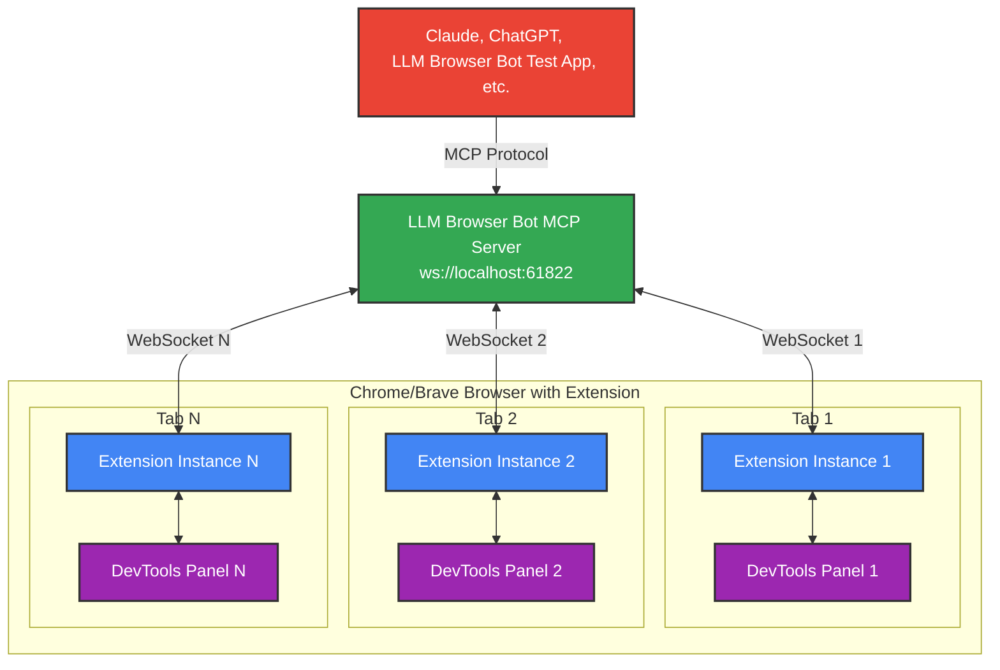
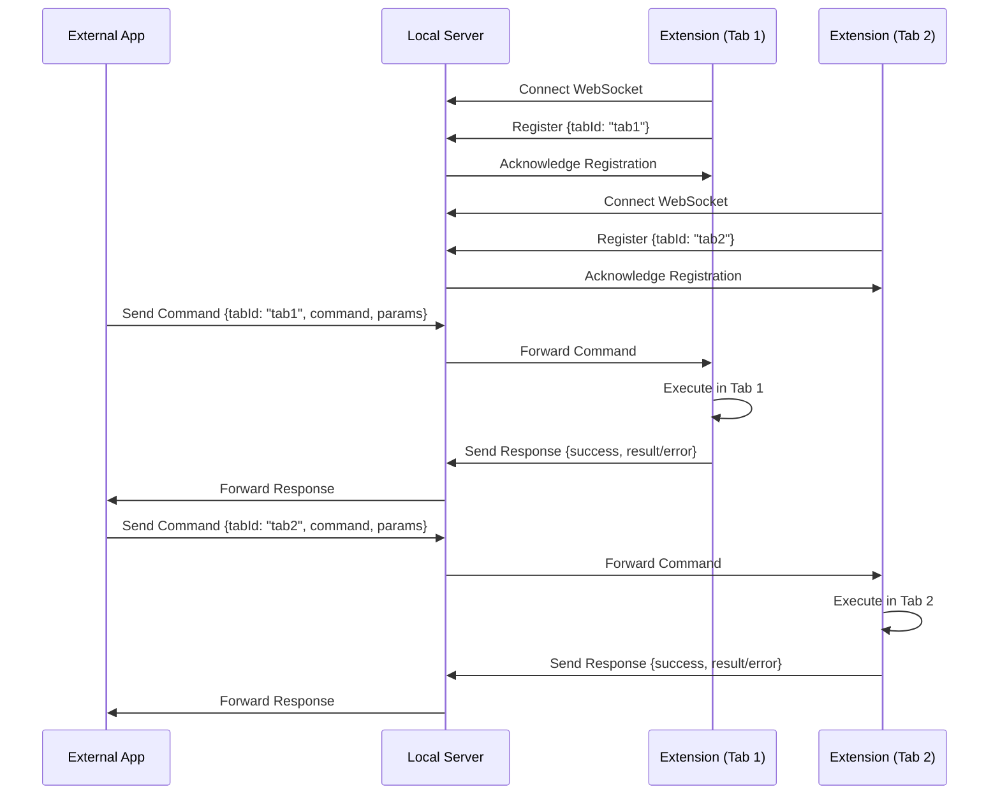
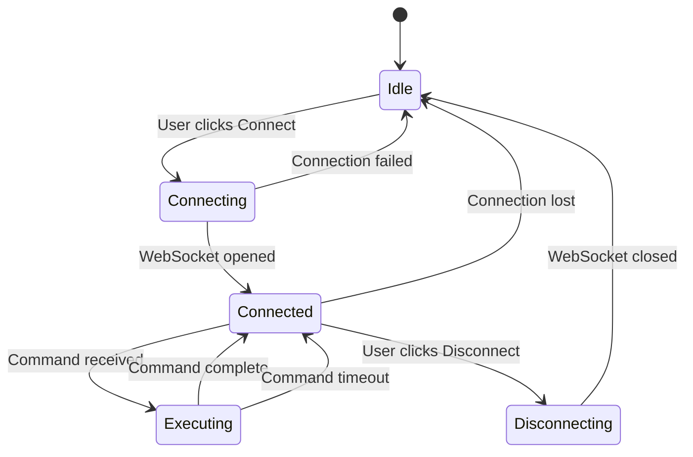
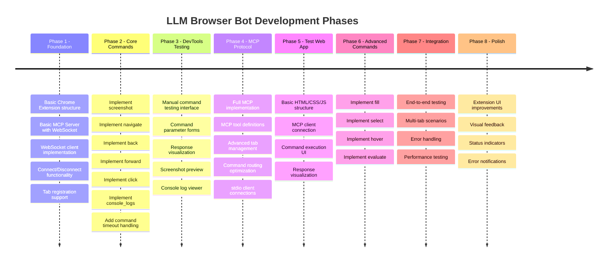

# LLM Browser Bot - Product Specification

## Overview
LLM Browser Bot is a Chrome DevTools Extension that provides remote browser automation capabilities similar to Puppeteer. It adds a "LLM Browser Bot" panel to Chrome DevTools where developers can establish WebSocket connections to a local server, allowing external applications (like Claude or other AI assistants) to control browser tabs through JSON-based commands.

## Architecture

### Components
1. **Chrome Extension** (per-tab instance)
   - Each tab runs its own extension instance
   - Maintains individual WebSocket connection to server
   - Manages command queue to ensure serial execution
   - Executes browser automation commands in its tab context
   - Provides DevTools panel for connection management
   
2. **Local MCP Server** (separate component)
   - Model Context Protocol (MCP) server implementation
   - Accepts WebSocket connections from Chrome Extension instances
   - Routes commands to specific tabs based on tabId
   - Tracks connection state and available tabs
   - Exposes MCP tools to clients (navigate, click, fill, screenshot, etc.)
   
3. **Test Web Application** (development tool)
   - Vanilla JavaScript single-page application
   - MCP client that connects to the Local MCP Server
   - UI for testing all MCP commands
   - Command history and response visualization

### System Architecture


### Communication Flow


## WebSocket Protocol

### Connection
- **URL**: `ws://localhost:61822`
- **Protocol**: WebSocket with JSON messages
- **Architecture**: Each browser tab runs its own extension instance with a dedicated WebSocket connection
- **Lifecycle**: 
  1. User opens Chrome DevTools (F12)
  2. Navigates to "LLM Browser Bot" panel
  3. Clicks "Connect" button in the panel
  4. WebSocket connection established for that specific tab

### Message Format

#### Client → Server (Registration)
```json
{
  "type": "register",
  "tabId": "auto-generated-uuid"
}
```

#### Server → Client (Command)
```json
{
  "id": "unique-command-id",
  "type": "command",
  "command": "navigate",
  "params": {
    "url": "https://example.com",
    "timeout": 30000
  }
}
```

#### Client → Server (Response)
```json
{
  "id": "unique-command-id",
  "type": "response",
  "success": true,
  "result": {
    // Command-specific response data
  },
  "error": null
}
```

#### Client → Server (Error Response)
```json
{
  "id": "unique-command-id",
  "type": "response",
  "success": false,
  "result": null,
  "error": {
    "message": "Element not found",
    "code": "ELEMENT_NOT_FOUND"
  }
}
```

## Supported Commands

### 1. navigate
Navigate to a specified URL.
```json
{
  "command": "navigate",
  "params": {
    "url": "string (required)",
    "timeout": "number (optional, default: 30000)"
  }
}
```

### 2. back
Navigate back in browser history.
```json
{
  "command": "back",
  "params": {}
}
```

### 3. forward
Navigate forward in browser history.
```json
{
  "command": "forward",
  "params": {}
}
```

### 4. screenshot
Capture a screenshot of the page or specific element.
```json
{
  "command": "screenshot",
  "params": {
    "name": "string (required)",
    "selector": "string (optional)",
    "width": "number (optional)",
    "height": "number (optional)"
  }
}
```
Returns: Base64 encoded image data

### 5. click
Click on a page element.
```json
{
  "command": "click",
  "params": {
    "selector": "string (required)"
  }
}
```

### 6. hover
Hover over a page element.
```json
{
  "command": "hover",
  "params": {
    "selector": "string (required)"
  }
}
```

### 7. fill
Fill an input field with a value.
```json
{
  "command": "fill",
  "params": {
    "selector": "string (required)",
    "value": "string (required)"
  }
}
```

### 8. select
Select an option from a dropdown.
```json
{
  "command": "select",
  "params": {
    "selector": "string (required)",
    "value": "string (required)"
  }
}
```

### 9. evaluate
Execute JavaScript code in the browser context.
```json
{
  "command": "evaluate",
  "params": {
    "code": "string (required)"
  }
}
```
Returns: Serialized result of the JavaScript execution

### 10. console_logs
Retrieve console.log messages from the browser console.
```json
{
  "command": "console_logs",
  "params": {
    "max": "number (optional, default: 100)"
  }
}
```
Returns: Array of console log entries (most recent first) with timestamp, level, and message

## User Interface

### DevTools Panel
The extension adds a "LLM Browser Bot" panel to Chrome DevTools (F12) with:

### Phase 1-2 (MVP)
- DevTools panel named "LLM Browser Bot"
- Panel contents:
  - Connection status indicator
  - "Connect" / "Disconnect" button
  - Simple status text showing connection state
  - Current tab information (URL, title)

### Phase 3 Features
- Manual command testing interface
- Command parameter input forms
- Response visualization area
- Screenshot preview display:
  - Image displayed as thumbnail
  - Click to open in new tab
- Console log viewer with max lines control
- Error message display

### Future Phases
- Visual command execution feedback
- Command history persistence
- Connection details display
- Advanced error notifications
- Command templates/shortcuts

## Technical Requirements

### Chrome Extension
- **Manifest Version**: 3
- **Extension Type**: DevTools Extension
- **Permissions Required**:
  - `debugger`: For executing commands in the inspected tab
  - `tabs`: For accessing tab information
  - `storage`: For persisting connection settings
  - Host permission for `localhost:61822`
- **DevTools Integration**:
  - `devtools.html`: Minimal page that loads devtools.js
  - `devtools.js`: Creates the "LLM Browser Bot" panel in DevTools
  - `panel/`: Contains the actual UI for the DevTools panel

### Command Execution
- **Queue**: Commands queued and executed sequentially in the Chrome Extension (one at a time per tab)
- **Timeout**: Default 30 seconds per command, enforced by the extension
- **Context**: Commands execute in the inspected tab via Chrome Debugger API
- **Flow**: 
  1. MCP Server receives command from client
  2. Server routes command to appropriate tab's WebSocket
  3. Extension adds command to its local queue
  4. Extension executes commands serially
  5. Extension sends response back through WebSocket



### Error Handling
- WebSocket connection failures
- Command timeouts
- Invalid selectors
- JavaScript execution errors
- Tab closed during execution

## Development Phases



### Phase 1: Foundation
- [ ] Basic Chrome Extension structure
- [ ] Basic MCP Server with WebSocket server listening on port 61822
- [ ] WebSocket client implementation in Extension
- [ ] Connect/Disconnect functionality
- [ ] Command message parsing
- [ ] Basic tab registration/deregistration

### Phase 2: Core Commands
- [ ] Implement screenshot
- [ ] Implement navigate
- [ ] Implement back
- [ ] Implement forward
- [ ] Implement click
- [ ] Implement console_logs
- [ ] Add command timeout handling

### Phase 3: DevTools Panel Testing Features
- [ ] Manual command testing interface in panel
- [ ] Command parameter input forms
- [ ] Response visualization in panel
- [ ] Screenshot preview display
- [ ] Console log viewer
- [ ] Error display and handling

### Phase 4: MCP Protocol Integration
- [ ] Full MCP server implementation with @modelcontextprotocol/sdk
- [ ] MCP tool definitions for all * commands
- [ ] Advanced tab management (heartbeat, metadata tracking)
- [ ] Command routing optimization
- [ ] Response handling and error propagation
- [ ] MCP client connection handling via stdio

### Phase 5: Test Web Application
- [ ] Basic HTML/CSS/JS structure
- [ ] MCP client connection via WebSocket
- [ ] Tab listing and selection UI
- [ ] Command execution interface
- [ ] Response visualization
- [ ] Command history tracking

### Phase 6: Advanced Commands
- [ ] Implement fill
- [ ] Implement select
- [ ] Implement hover
- [ ] Implement evaluate

### Phase 7: Integration Testing
- [ ] End-to-end command flow testing
- [ ] Multi-tab scenario testing
- [ ] Error handling verification
- [ ] Performance and timeout testing

### Phase 8: UI Enhancement
- [x] Extension UI improvements
- [x] Visual command feedback
- [x] Connection status indicators
- [x] Error notifications

## Security Considerations

### Current Phase
- Local-only connections (localhost)
- No authentication required

### Future Considerations
- Optional authentication tokens
- Command whitelisting
- Rate limiting
- Secure WebSocket (wss://) option

## Local MCP Server Specification

### Overview
The Local MCP Server is a Model Context Protocol server that bridges MCP clients (like Claude, test webapp) with Chrome Extension instances running in browser tabs.

### MCP Tool Definitions
Each * command will be exposed as an MCP tool with proper schemas:

```typescript
// Tool: navigate
{
  name: "navigate",
  description: "Navigate browser tab to specified URL",
  inputSchema: {
    type: "object",
    properties: {
      tabId: { type: "string", description: "Target tab ID" },
      url: { type: "string", description: "URL to navigate to" },
      timeout: { type: "number", description: "Navigation timeout in ms", default: 30000 }
    },
    required: ["tabId", "url"]
  }
}

// Tool: back
{
  name: "back",
  description: "Navigate back in browser history",
  inputSchema: {
    type: "object",
    properties: {
      tabId: { type: "string", description: "Target tab ID" }
    },
    required: ["tabId"]
  }
}

// Tool: forward
{
  name: "forward",
  description: "Navigate forward in browser history",
  inputSchema: {
    type: "object",
    properties: {
      tabId: { type: "string", description: "Target tab ID" }
    },
    required: ["tabId"]
  }
}

// Tool: list_tabs
{
  name: "list_tabs",
  description: "List all connected browser tabs",
  inputSchema: {
    type: "object",
    properties: {},
    required: []
  }
}

// Tool: console_logs
{
  name: "console_logs",
  description: "Retrieve console log messages from browser tab (most recent first)",
  inputSchema: {
    type: "object",
    properties: {
      tabId: { type: "string", description: "Target tab ID" },
      max: { type: "number", description: "Maximum number of log entries to return", default: 100 }
    },
    required: ["tabId"]
  }
}

// Additional tools follow the same pattern...
```

### Server Implementation
- **Language**: Node.js/TypeScript
- **MCP SDK**: @modelcontextprotocol/sdk
- **WebSocket Server**: ws library for Chrome Extension connections
- **MCP Transport**: stdio for MCP client connections

### Connection Management
1. **Chrome Extension Registration**:
   - Extensions connect via WebSocket
   - Register with unique tabId
   - Server maintains tab registry with metadata (URL, title, connection time)
   - Heartbeat/ping mechanism to detect disconnected tabs

2. **MCP Client Connection**:
   - Clients connect via stdio (standard MCP)
   - Can list available tabs via list_tabs
   - Can invoke tools on specific tabs
   - Receives errors if tab is disconnected

### Error Handling
- **TAB_NOT_FOUND**: When specified tabId doesn't exist
- **TAB_DISCONNECTED**: When tab WebSocket connection is lost
- **COMMAND_TIMEOUT**: When command exceeds timeout
- **INVALID_SELECTOR**: When CSS selector is invalid
- **EXECUTION_ERROR**: When JavaScript evaluation fails

### Server Architecture
```
MCP Server
├── MCP Handler (stdio)
│   ├── Tool Registry
│   └── Request Router
└── WebSocket Server (:61822)
    ├── Connection Manager
    ├── Tab Registry
    └── Message Router

Chrome Extension (per tab)
├── DevTools Panel UI
├── WebSocket Client
├── Command Queue
│   ├── Queue Management
│   └── Timeout Handler
├── Console Log Collector
│   └── Circular Log Buffer
└── Command Executor
    ├── Navigation
    ├── Interaction
    ├── Evaluation
    └── Console Access
```

## Test Web Application Specification

### Overview
A vanilla JavaScript SPA for testing the MCP server and Chrome Extension integration during development.

### Technical Stack
- **HTML5/CSS3**: Semantic markup with modern CSS
- **Vanilla JavaScript**: No frameworks, ES6+ modules
- **MCP Client**: WebSocket connection to MCP server
- **JSON Editor**: CodeMirror or Monaco for parameter editing
- **Local Storage**: For command history persistence

### Features
1. **MCP Connection**:
   - Connect/disconnect to MCP server
   - Display connection status
   - Show available tools

2. **Tab Management**:
   - List connected tabs
   - Select target tab for commands
   - Show tab status (URL, title)

3. **Command Interface**:
   - Form inputs for each * command
   - JSON editor for custom parameters
   - Execute button with loading state

4. **Response Display**:
   - Success/error status
   - Response data visualization
   - Execution time tracking

5. **History Panel**:
   - Command history with timestamps
   - Re-run previous commands
   - Export history as JSON

### UI Layout
```
+----------------------------------+
|  LLM Browser Bot Test Client            |
+----------------------------------+
| Connection: [●] Connected        |
| Server: ws://localhost:61822      |
+----------------------------------+
| Connected Tabs:                  |
| [●] tab1 - Example.com          |
| [ ] tab2 - Google.com           |
+----------------------------------+
| Command: [navigate ▼] |
| Parameters:                      |
| +------------------------------+ |
| | {                            | |
| |   "url": "https://..."       | |
| | }                            | |
| +------------------------------+ |
| [Execute] [Clear]               |
+----------------------------------+
| Response:                        |
| Status: Success (125ms)          |
| +------------------------------+ |
| | {                            | |
| |   "success": true,           | |
| |   "result": {...}            | |
| | }                            | |
| +------------------------------+ |
+----------------------------------+
| History:                         |
| 10:23:45 - navigate ✓           |
| 10:23:40 - click ✓              |
| 10:23:35 - fill ✗               |
+----------------------------------+
```

## Success Criteria
1. Stable WebSocket connection management
2. Reliable command execution with proper error handling
3. Support for all specified Puppeteer-like commands
4. Proper command queuing and timeout handling
5. Clear connection state management in UI
6. MCP server properly exposes all tools
7. Test webapp successfully tests all functionality
8. Console log collection works reliably across page navigations

## Project Structure

```
kapture/
├── extension/                    # Chrome Extension
│   ├── manifest.json
│   ├── background.js            # Service worker
│   ├── devtools.html           # DevTools page loader
│   ├── devtools.js             # DevTools initialization
│   ├── panel/                  # DevTools panel UI
│   │   ├── panel.html
│   │   ├── panel.js
│   │   └── panel.css
│   └── icons/                  # Extension icons
├── server/                     # MCP Server
│   ├── package.json
│   ├── tsconfig.json
│   ├── src/
│   │   ├── index.ts           # Main server entry
│   │   ├── mcp-handler.ts     # MCP protocol handler
│   │   ├── websocket-server.ts # WebSocket management
│   │   ├── tab-registry.ts    # Tab connection registry
│   │   └── tools/             # MCP tool definitions
│   │       ├── navigate.ts
│   │       ├── click.ts
│   │       └── ...
│   └── dist/                  # Compiled output
├── test-app/                  # Test Web Application
│   ├── index.html
│   ├── style.css
│   ├── app.js                # Main application
│   ├── mcp-client.js         # MCP WebSocket client
│   └── components/           # UI components
│       ├── connection.js
│       ├── tabs.js
│       ├── command-editor.js
│       └── history.js
└── docs/                     # Documentation
    ├── API.md               # API documentation
    ├── SETUP.md            # Setup instructions
    └── CONTRIBUTING.md     # Contribution guidelines
```

## Configuration

### Chrome Extension Manifest (v3)
```json
{
  "manifest_version": 3,
  "name": "LLM Browser Bot Browser Automation",
  "version": "1.0.0",
  "description": "Remote browser automation via MCP - DevTools Extension",
  "permissions": [
    "debugger",
    "tabs",
    "storage"
  ],
  "host_permissions": [
    "http://localhost:61822/*",
    "ws://localhost:61822/*"
  ],
  "background": {
    "service_worker": "background.js"
  },
  "devtools_page": "devtools.html",
  "icons": {
    "16": "icons/icon16.png",
    "48": "icons/icon48.png",
    "128": "icons/icon128.png"
  }
}
```

### MCP Server Configuration
```json
{
  "name": "kapture-mcp-server",
  "version": "1.0.0",
  "description": "MCP server for LLM Browser Bot browser automation",
  "main": "dist/index.js",
  "scripts": {
    "build": "tsc",
    "start": "node dist/index.js",
    "dev": "tsx watch src/index.ts"
  },
  "dependencies": {
    "@modelcontextprotocol/sdk": "^0.5.0",
    "ws": "^8.0.0"
  },
  "devDependencies": {
    "@types/ws": "^8.0.0",
    "typescript": "^5.0.0",
    "tsx": "^4.0.0"
  }
}
```

### DevTools Extension Files

#### devtools.html
```html
<!DOCTYPE html>
<html>
<body>
  <script src="devtools.js"></script>
</body>
</html>
```

#### devtools.js
```javascript
// Create the LLM Browser Bot panel in DevTools
chrome.devtools.panels.create(
  "LLM Browser Bot",                    // Panel title
  "icons/icon16.png",          // Panel icon
  "panel/panel.html",          // Panel HTML page
  function(panel) {
    // Panel created callback
  }
);
```
